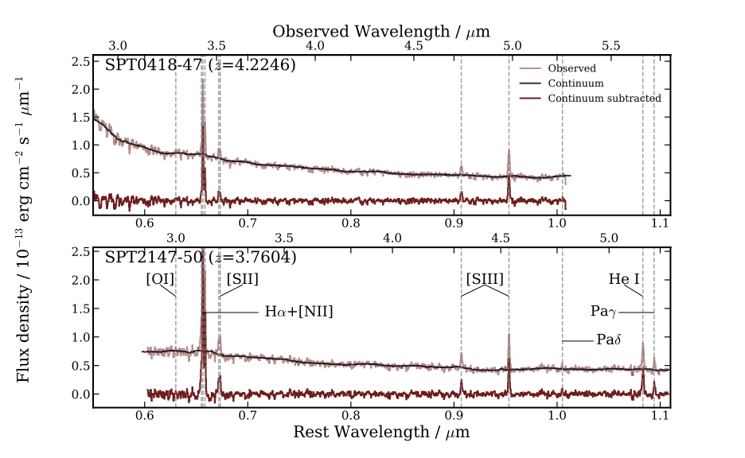

Birkin et al. (2023), arXiv:2307.10412 (ApJ accepted)
=======================================

[ADS](https://ui.adsabs.harvard.edu/abs/2023arXiv230710412B/abstract) | [arXiv](https://arxiv.org/pdf/2307.10412.pdf)

In this paper we present resolved metallicity maps for two lensed dust-obscured star forming galaxies (DSFGs) at z~4, using JWST/NIRSpec data from the TEMPLATES ERS program. The maps are derived by combining resolved measurements of the [NII]/H-alpha flux ratio with optical line-metallicity calibrations from the literature. We also compare the integrated metallicity measurements with predictions from the mass-metallicity relation and fundamental metallicity relation. Finally, we utilize ALMA rest-frame 380um continuum and [CI] data to estimate the spatial variation of the gas-to-dust ratio in the two DSFGs, finding this to be anticorrelated with the metallicity on ~kpc scales.

Questions about this paper can be directed to Jack: [jbirkin@tamu.edu](mailto:jbirkin@tamu.edu)



Citation
--------

```
@ARTICLE{2023arXiv230710412B,
       author = {{Birkin}, Jack E. and {Hutchison}, Taylor A. and {Welch}, Brian and {Spilker}, Justin S. and {Aravena}, Manuel and {Bayliss}, Matthew B. and {Cathey}, Jared and {Chapman}, Scott C. and {Gonzalez}, Anthony H. and {Gururajan}, Gayathri and {Hayward}, Christopher C. and {Khullar}, Gourav and {Kim}, Keunho J. and {Mahler}, Guillaume and {Malkan}, Matthew A. and {Narayanan}, Desika and {Olivier}, Grace M. and {Phadke}, Kedar A. and {Reuter}, Cassie and {Rigby}, Jane R. and {Smith}, J.~D.~T. and {Solimano}, Manuel and {Sulzenauer}, Nikolaus and {Vieira}, Joaquin D. and {Vizgan}, David and {Weiss}, Axel},
        title = "{JWST's TEMPLATES for Star Formation: The First Resolved Gas-Phase Metallicity Maps of Dust-Obscured Star-Forming Galaxies at $z$ $\sim$ 4}",
      journal = {arXiv e-prints},
     keywords = {Astrophysics - Astrophysics of Galaxies},
         year = 2023,
        month = jul,
          eid = {arXiv:2307.10412},
        pages = {arXiv:2307.10412},
          doi = {10.48550/arXiv.2307.10412},
archivePrefix = {arXiv},
       eprint = {2307.10412},
 primaryClass = {astro-ph.GA},
       adsurl = {https://ui.adsabs.harvard.edu/abs/2023arXiv230710412B},
      adsnote = {Provided by the SAO/NASA Astrophysics Data System}
}


```
