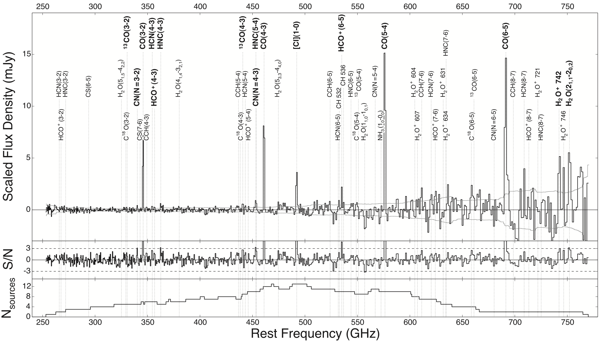

Spilker et al. (2014), ApJ, 785, 149
====================================

[ADS](https://ui.adsabs.harvard.edu/abs/2014ApJ...785..149S/abstract) | [arXiv](https://arxiv.org/abs/1403.1667)

In this paper (my first!) we presented the stacked sub/mm spectrum of 22 high-redshift
dusty galaxies based on early (cycle 0) ALMA 3mm data. Aside from the usual very bright
CO and [CI] lines, we also detected or placed constraints on dozens of lines from a 
bunch of other molecules whose transitions are usually more than 10x fainter than the
brightest lines.

This repository contains the actual stacked spectrum itself, which should be able to
exactly reproduce Fig. 2 in the paper. I also provide the list of all the transitions
(Table 3) and molecules we constrained (Table 4, at the end of the 
[faint lines file](Faint_line_properties_s14mm.txt)).

Lastly, the CO SLEDs (including ours) from Figure 3 are in the [SLEDs folder](CO_SLEDs).
I know someone gave me most of these that they had previously compiled, but as I sit 
here in 2020 I really can't remember who it was -- sorry about that!!

Updates
-------

This paper was based on very early ALMA data for just 22 SPT sources. In subsequent
years we've put a lot of effort into getting redshifts for many more sources,
culminating in [Reuter et al. 2020](https://ui.adsabs.harvard.edu/abs/2020arXiv200614060R/abstract);
we are now 100% spectroscopically complete for the full sample. While we haven't yet
revisited the faint line stacking analysis of this paper, Cassie has produced a new
stacked spectrum similar to Figure 2 from my paper, shown in the bottom of her
Figure 3.  Given the 4x increase in number of sources, that one looks way better than
my original version, and you should probably email Cassie for the new stack instead 
of using mine.

Citation
--------

    @ARTICLE{spilker14,
           author = {{Spilker}, J.~S. and {Marrone}, D.~P. and {Aguirre}, J.~E. and
             {Aravena}, M. and {Ashby}, M.~L.~N. and {B{\'e}thermin}, M. and
             {Bradford}, C.~M. and {Bothwell}, M.~S. and {Brodwin}, M. and
             {Carlstrom}, J.~E. and {Chapman}, S.~C. and {Crawford}, T.~M. and
             {de Breuck}, C. and {Fassnacht}, C.~D. and {Gonzalez}, A.~H. and
             {Greve}, T.~R. and {Gullberg}, B. and {Hezaveh}, Y. and
             {Holzapfel}, W.~L. and {Husband}, K. and {Ma}, J. and {Malkan}, M. and
             {Murphy}, E.~J. and {Reichardt}, C.~L. and {Rotermund}, K.~M. and
             {Stalder}, B. and {Stark}, A.~A. and {Strandet}, M. and
             {Vieira}, J.~D. and {Wei{\ss}}, A. and {Welikala}, N.},
            title = "{The Rest-frame Submillimeter Spectrum of High-redshift, Dusty, Star-forming Galaxies}",
          journal = {\apj},
         keywords = {galaxies: high-redshift, galaxies: ISM, galaxies: star formation, ISM: molecules, Astrophysics - Astrophysics of Galaxies, Astrophysics - Cosmology and Nongalactic Astrophysics},
             year = 2014,
            month = apr,
           volume = {785},
           number = {2},
              eid = {149},
            pages = {149},
              doi = {10.1088/0004-637X/785/2/149},
    archivePrefix = {arXiv},
           eprint = {1403.1667},
     primaryClass = {astro-ph.GA},
           adsurl = {https://ui.adsabs.harvard.edu/abs/2014ApJ...785..149S},
          adsnote = {Provided by the SAO/NASA Astrophysics Data System}
    }

