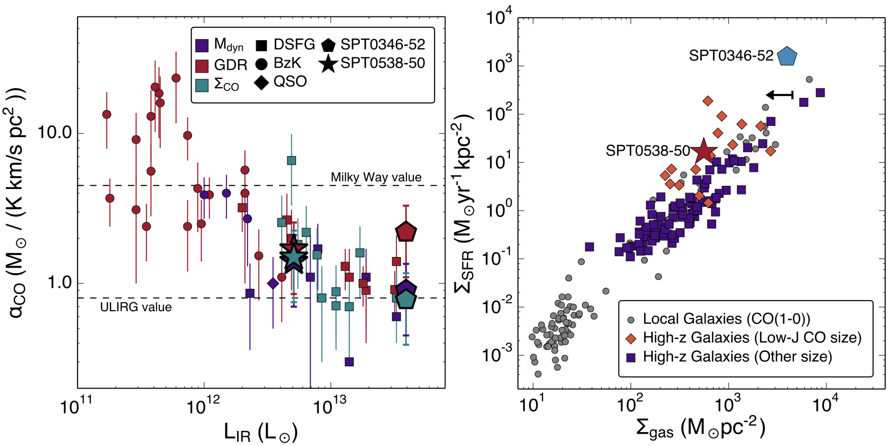

Spilker et al. (2015), ApJ, 811, 124
====================================

[ADS](https://ui.adsabs.harvard.edu/abs/2015ApJ...811..124S/abstract) | [arXiv](https://arxiv.org/abs/1508.07369)

In this paper we presented spatially-resolved imaging of low-J CO lines in two
lensed dusty star-forming galaxies. We constrained the infamous CO-H2 conversion 
factor in multiple independent ways and found good agreement between the methods. 
We found that the CO emission was more spatially extended than the dust 
continuum -- a finding that's been corroborated by a number of studies since we 
published this work. As a result of the difference in the size of the emitting
region, we made the point that galaxies would move leftwards in a Kennicutt-Schmidt
plot, because the gas surface densities are actually lower in reality than if you
assumed a size measured at some other wavelength.

The [high-z alphaCO](highz_alphco.txt) file contains the compilation of all the 
CO-H2 conversion factor constraints I assembled for high-redshift galaxies, used
in Figure 6. No doubt there are more objects with alphaCO estimates by now, but
this is probably a good starting point.

Citation
--------

    @ARTICLE{spilker15,
           author = {{Spilker}, J.~S. and {Aravena}, M. and {Marrone}, D.~P. and
             {B{\'e}thermin}, M. and {Bothwell}, M.~S. and {Carlstrom}, J.~E. and
             {Chapman}, S.~C. and {Collier}, J.~D. and {de Breuck}, C. and
             {Fassnacht}, C.~D. and {Galvin}, T. and {Gonzalez}, A.~H. and
             {Gonz{\'a}lez-L{\'o}pez}, J. and {Grieve}, K. and {Hezaveh}, Y. and
             {Ma}, J. and {Malkan}, M. and {O'Brien}, A. and {Rotermund}, K.~M. and
             {Strandet}, M. and {Vieira}, J.~D. and {Weiss}, A. and {Wong}, G.~F.},
            title = "{Sub-kiloparsec Imaging of Cool Molecular Gas in Two Strongly Lensed Dusty, Star-forming Galaxies}",
          journal = {\apj},
         keywords = {galaxies: high-redshift, galaxies: ISM, galaxies: star formation, ISM: molecules, Astrophysics - Astrophysics of Galaxies},
             year = 2015,
            month = oct,
           volume = {811},
           number = {2},
              eid = {124},
            pages = {124},
              doi = {10.1088/0004-637X/811/2/124},
    archivePrefix = {arXiv},
           eprint = {1508.07369},
     primaryClass = {astro-ph.GA},
           adsurl = {https://ui.adsabs.harvard.edu/abs/2015ApJ...811..124S},
          adsnote = {Provided by the SAO/NASA Astrophysics Data System}
    }

