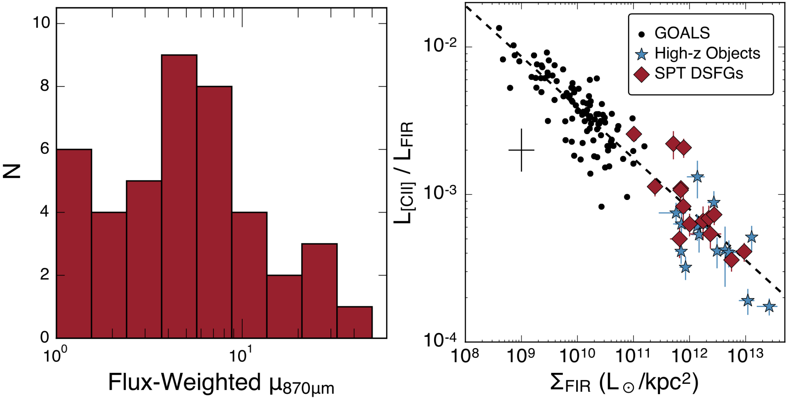

Spilker et al. (2016), ApJ, 826, 112
====================================

[ADS](https://ui.adsabs.harvard.edu/abs/2016ApJ...826..112S/abstract) | [arXiv](https://arxiv.org/abs/1604.05723)

This paper was a big chunk of my PhD thesis. I spent a too-large chunk of my 
life making gravitational lens models for about 50 SPT-selected dusty star-forming
galaxies. We've since used the magnifications and intrinsic sizes for a lot of
different projects.

You can access all the results of the lens models in [this folder](lensmodel_results);
this basically consolidates Tables 3 and 4 from the paper. There are a few wonky things
to keep in mind, so be sure to check out the readme in that folder as well. 

The points used to create Figure 7, exploring the "[CII deficit]" in terms of the far-IR
surface density at low- and high-redshift, are [here](lcii_lfir.txt). Note, however, that
this sample is now several years out of date, and there has been a lot of new resolved-CII
data coming out of ALMA. Also, the GOALS collaboration has released improved measurements
of the FIR surface density for their nearby ULIRGs as part of 
[Diaz-Santos et al. 2017](https://ui.adsabs.harvard.edu/abs/2017ApJ...846...32D/abstract).
Those values (as of late 2020) were available on the 
[GOALS website](http://goals.ipac.caltech.edu/highlights/highlights.html).

The lens modeling code I developed as part of this paper, `visilens`, is publicly available as well.
It is designed to quickly model observations from interferometers like ALMA or the VLA.
That package is also available [from github](https://github.com/jspilker/visilens).

Updates
-------

At the time this paper was published we didn't have as many spectroscopic redshifts as
we do now. I've updated the files in the [lens model results](lensmodel_results) folder
to include all available spectroscopic redshifts. All the values were given in angular
units (e.g. arcsec) which don't rely on redshift, but now you can convert them to e.g.
effective sizes in physical units, or get the lens masses from the Einstein radii. Please 
cite [Reuter et al. 2020](https://ui.adsabs.harvard.edu/abs/2020arXiv200614060R/abstract)
alongside this paper if you use the lens model results.

Citation
--------

    @ARTICLE{spilker16a,
           author = {{Spilker}, J.~S. and {Marrone}, D.~P. and {Aravena}, M. and
             {B{\'e}thermin}, M. and {Bothwell}, M.~S. and {Carlstrom}, J.~E. and
             {Chapman}, S.~C. and {Crawford}, T.~M. and {de Breuck}, C. and
             {Fassnacht}, C.~D. and {Gonzalez}, A.~H. and {Greve}, T.~R. and
             {Hezaveh}, Y. and {Litke}, K. and {Ma}, J. and {Malkan}, M. and
             {Rotermund}, K.~M. and {Strandet}, M. and {Vieira}, J.~D. and
             {Weiss}, A. and {Welikala}, N.},
            title = "{ALMA Imaging and Gravitational Lens Models of South Pole Telescope{\textemdash}Selected Dusty, Star-Forming Galaxies at High Redshifts}",
          journal = {\apj},
         keywords = {galaxies: high-redshift, galaxies: ISM, galaxies: star formation, Astrophysics - Astrophysics of Galaxies},
             year = 2016,
            month = aug,
           volume = {826},
           number = {2},
              eid = {112},
            pages = {112},
              doi = {10.3847/0004-637X/826/2/112},
    archivePrefix = {arXiv},
           eprint = {1604.05723},
     primaryClass = {astro-ph.GA},
           adsurl = {https://ui.adsabs.harvard.edu/abs/2016ApJ...826..112S},
          adsnote = {Provided by the SAO/NASA Astrophysics Data System}
    }
