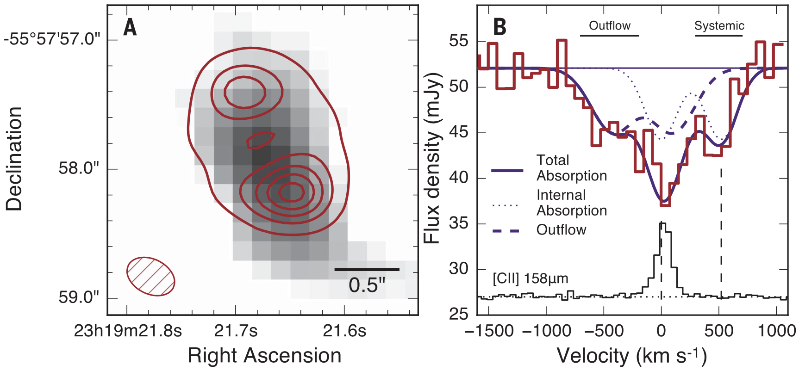

Spilker et al. (2018), Science, 361, 1016
=========================================

[ADS](https://ui.adsabs.harvard.edu/abs/2018Sci...361.1016S/abstract) | [arXiv](https://arxiv.org/abs/1809.01676)

This repository contains the data products and lens modeling results and inputs from Spilker et al. (2018).
This folder contains everything that is also in the repository linked in the original
journal article (I'm just reorganizing for the sake of my own sanity...).
If there's anything not posted here that you'd like, just send me an email.

Updates
-------

This paper presented the first outflow from what I've now assembled into a sample of z>4 outflows
from the SPT survey. Data / tables / etc. for the full sample are available 
[here](https://github.com/jspilker/data/tree/master/2020_hiz_moloutflow_sample). I strongly recommend you
use the values there for things like outflow rates etc. because we did a much more thorough job
in the more recent papers.

dataproducts
------------

This folder has everything that doesn't involve lensing in any way - a naturally-weighted continuum image of
the ALMA data, an image cube, and a spectrum I extracted from that cube of the OH absorption lines. The 
continuum image and spectrum were used to make Figure 1 in the paper.

lensproducts
------------

This folder has all of the results of the lens modeling in FITS format. There are three sets of FITS files, for
the OH continuum (500km/s of line-free continuum to match the OH reconstructions), the systemic OH absorption, and
the blueshifted wind absorption. Each set has a (dirty) image of the data, model, and residuals, and the reconstructed
source plane. Because the lens modeling is done on the visibilities directly, dirty images are about the closest
approximations that are still useful to inspect. Also included are the continuum-subtracted absorption components. With 
those two files and the continuum source plane reconstruction, you can reproduce Figure 2 in the paper. 

I didn't upload all the MCMC chains from fitting for the lensing deflections (there's a lot), but if you want or need
those for any reason feel free to email me.

lensinputs
----------

This folder has the binary visibility data in the format our lensing code uses, and an XML parameters file showing how
to create the reconstructions from those data inputs. A binary executable of the lensing code is hosted 
[here](https://github.com/yasharhezaveh/Ripple/releases). Note that you'll need a working MPI installation, GSL,
and the [Elemental](http://libelemental.org/) linear algebra library. 

Citation
--------

    @ARTICLE{2018Sci...361.1016S,
           author = {{Spilker}, J.~S. and {Aravena}, M. and {B{\'e}thermin}, M. and
             {Chapman}, S.~C. and {Chen}, C. -C. and {Cunningham}, D.~J.~M. and
             {De Breuck}, C. and {Dong}, C. and {Gonzalez}, A.~H. and
             {Hayward}, C.~C. and {Hezaveh}, Y.~D. and {Litke}, K.~C. and {Ma}, J. and
             {Malkan}, M. and {Marrone}, D.~P. and {Miller}, T.~B. and
             {Morningstar}, W.~R. and {Narayanan}, D. and {Phadke}, K.~A. and
             {Sreevani}, J. and {Stark}, A.~A. and {Vieira}, J.~D. and
             {Wei{\ss}}, A.},
            title = "{Fast molecular outflow from a dusty star-forming galaxy in the early Universe}",
          journal = {Science},
         keywords = {ASTRONOMY, Astrophysics - Astrophysics of Galaxies},
             year = 2018,
            month = sep,
           volume = {361},
           number = {6406},
            pages = {1016-1019},
              doi = {10.1126/science.aap8900},
    archivePrefix = {arXiv},
           eprint = {1809.01676},
     primaryClass = {astro-ph.GA},
           adsurl = {https://ui.adsabs.harvard.edu/abs/2018Sci...361.1016S},
          adsnote = {Provided by the SAO/NASA Astrophysics Data System}
    }

