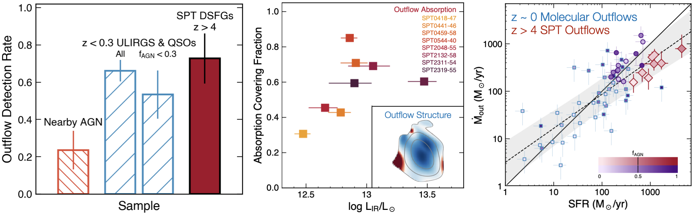

Spilker et al. (2020 a & b), ApJ accepted
=======================================

Questions can be directed to Justin: [jspilker@utexas.edu](mailto:jspilker@utexas.edu)

I'm very pleased to present the results from a lot of effort to build the first sample of
z > 4 molecular outflows, which we present in a pair of papers. Not only is this the first
statistical sample of outflows in the early universe, but we can spatially resolve the
outflows on ~few hundred parsec scales due to gravitational lensing at the same time.
The first paper focuses mainly on the overall sample properties and the resolved structure 
of the outflows, while the second paper focues on the outflow rates and energetics and so on.

The files here combine all the tables from both papers in a way that I hope is useful for
folks who want to use this sample. We're in the regime where we have measured many different 
quantities for a small number of objects, so the files have lots of columns but few rows. If 
there is anything else from this sample that you want or need, just ask! I will happily 
provide spectra/images/maps/etc if you need them for something.

I've tried to divide things up in a sensible way that hopefully isn't too much of a headache 
for most people. There is some overlap between these files.

- ``spilker2020_column_description.txt``:
    Gives a longer description of what all the columns in all files are.
    
- ``spilker2020_outflows_mostuseful.txt``:
    Contains what I'm guessing will be the most useful for the most people, sample observed properties and outflow derived properties. If you just want to add these objects to a SFR vs Mdotout plot or something, this file is for you.

- ``spilker2020_outflows_OH_observables.txt``:
    Contains various observable properties of the OH spectra - velocity metrics (e.g. v_50, v_max), equivalent widths, and all the Gaussian fit parameters from Paper I

- ``spilker2020_outflows_alloutflowrates.txt``:
    Basically a reproduction of Table 1 in Paper II, contains all outflow rates from all methods as well as the final 'best' outflow rates/masses/energetics

How to use these files
----------------------

For python users, I've found the easiest way to play around with these is using the pandas package:

    import pandas as pd
    S20 = pd.read_csv('spilker2020_outflows_mostuseful.txt',delim_whitespace=True,index_col=0,comment='#')
    
    # Get one column from the full dataframe:
    print(S20['LIR'])
    
    # Get multiple columns:
    print(S20[['LIR','Mdotout']])
    
    # Get one row from the full dataframe:
    print(S20.loc['SPT2319-55'])
    
    # Get multiple rows from the full dataframe:
    print(S20.loc[['SPT0418-47','SPT2319-55']])
    
    # Get multiple columns where a certain condition has been met:
    print(S20.loc[S20['outflow']==True, ['LIR','Mdotout']])
    print(S20.loc[S20['LIR'] < 1e13, ['LIR','Mdotout']])
    
    # Print all row names (the dataframe "index")
    print(S20.index)
    
    # Print all column names
    print(S20.columns)
    
    # Combine all three tables into one giant dataframe
    # Note you can select a subset of the columns by adding 
    # usecols=['list','of','colnames'] to the read_csv calls below
    S20 = S20.merge(pd.read_csv('spilker2020_outflows_OH_observables.txt',delim_whitespace=True,index_col=0,comment='#'),
          left_index=True,right_index=True,how='outer',suffixes=('','_dup'))
    S20 = S20.merge(pd.read_csv('spilker2020_outflows_alloutflowrates.txt',delim_whitespace=True,index_col=0,comment='#'),
          left_index=True,right_index=True,how='outer',suffixes=('','_dup'))
    # Remove duplicate columns that we appended _dup to
    S20.drop(list(S20.filter(regex='_dup$')),axis=1,inplace=True)

General notes and formatting
----------------------------

1. **There are outflow properties listed even for sources that don't (unambiguously) show an outflow.** 
    All of the methods in Paper II can/do/will spit out an outflow rate based on the observables, even 
    if a particular source doesn't have an outflow (see long discussion in Paper I). Instead you should 
    use the `outflow` True/False column to remove the sources that don't show an outflow. Why did I do 
    this? (a) it makes the table much simpler, (b) we did detect OH in all sources and at some level 
    which ones have an outflow or not is well, just, like, my opinion, man, and maybe you have a 
    different opinion or you're from the future and know that some source I thought was ambiguous 
    really does have a true outflow.

2. Uncertainties on properties start with a 'd', so 'dLIR' is the 1sigma uncertainy on 'LIR'. In some cases I've tried to be fancy and calculated asymmetric uncertainties, which have '_p' or '_m' at the end, referring to the plus/minus uncertainty (i.e. 16/84th percentile confidence interval). Some columns only have estimated uncertainties, which I've noted in the headers of each file.
