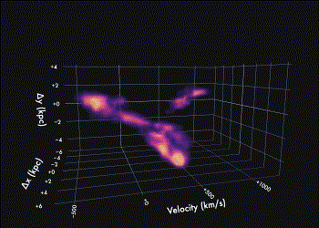

Spilker et al. (2022), to be submitted
=======================================

In this paper we show off the structure of the z = 7 system SPT0311-58, currently the most massive system known in the reionization era. Using 0.07" imaging of the dust and CII emission from ALMA, we found that the system breaks up into at least a dozen kiloparsec-scale clumps.

3D Rendering of the CII emission
--------------------------------

Do yourself a favor and play around with the interactive 3D rendering of the CII data cube - it's really nifty!

- Downsampled rendering: [spt0311_ciicube_downsample.html](https://htmlpreview.github.io/?https://github.com/spt-smg/publicdata/blob/master/spilker2022_SPT0311-58_z7_clumps/spt0311_ciicube_downsample.html)
  This cube version has been downsampled in the spatial dimensions for smaller file size faster rendering time

- Full-resolution rendering: [spt0311_ciicube.html](https://htmlpreview.github.io/?https://github.com/spt-smg/publicdata/blob/master/spilker2022_SPT0311-58_z7_clumps/spt0311_ciicube.html)
  Here's the full thing in all its glory. Just give it a while to load and render!
  

