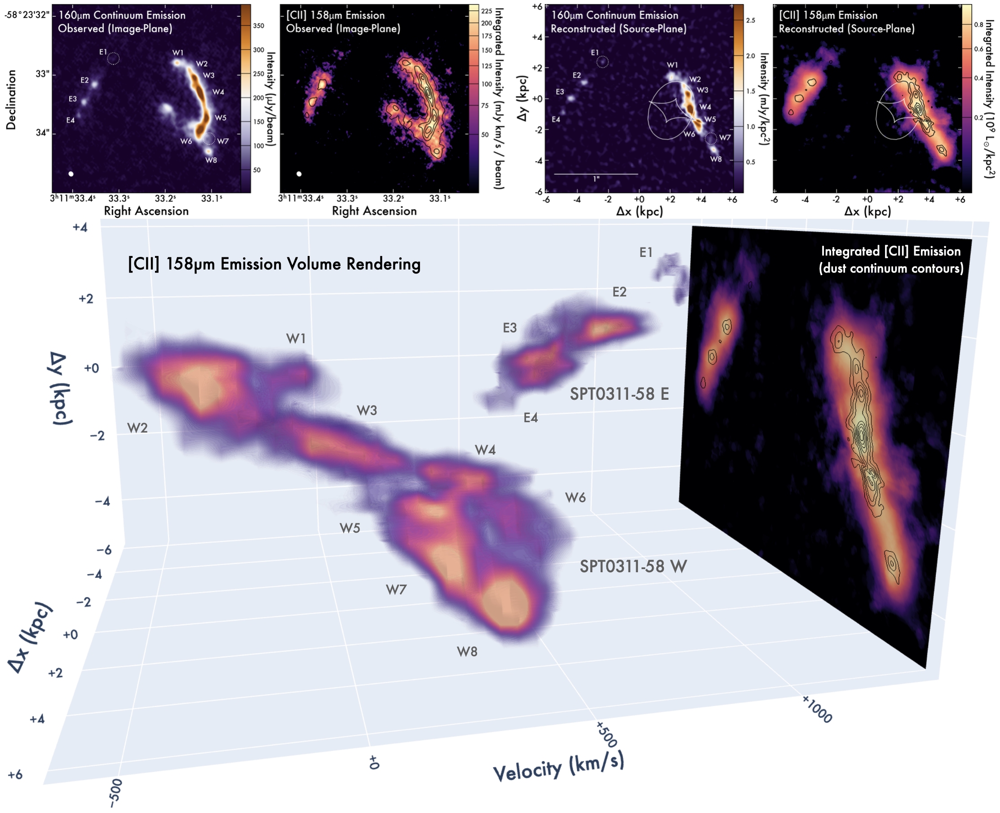

Spilker et al. (2022), to be submitted
=======================================

In this paper we show off the structure of the z = 7 system SPT0311-58, currently the most massive system known in the reionization era. Using 0.07" imaging of the dust and CII emission from ALMA, we found that the system breaks up into at least a dozen kiloparsec-scale clumps.

3D Rendering of the CII emission
--------------------------------

Do yourself a favor and play around with an interactive 3D rendering of the CII data cube - it's neat and fun!

- Downsampled (1.5x1.5) rendering (87MB): [``spt0311_ciicube_downsample1.5.html``](https://htmlpreview.github.io/?https://github.com/spt-smg/publicdata/blob/master/spilker2022_SPT0311-58_z7_clumps/spt0311_ciicube_downsample1.5.html)\
  This cube version has been 1.5x1.5 downsampled in the spatial dimensions for smaller file size and faster rendering time.

- Downsampled (3x3) rendering (21MB): [``spt0311_ciicube_downsample3.0.html``](https://htmlpreview.github.io/?https://github.com/spt-smg/publicdata/blob/master/spilker2022_SPT0311-58_z7_clumps/spt0311_ciicube_downsample3.0.html)\
  This version is also downsampled, by 3x3 in the spatial dimensions. It looks significantly jankier than the higher-res cube, but is even smaller and faster!
  
- Full-resolution version (180MB) available on request
  
  

